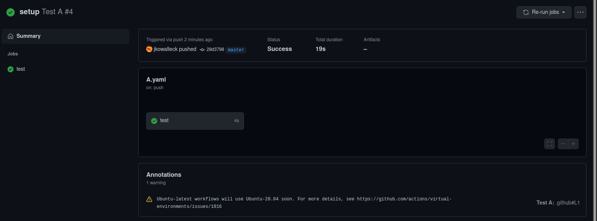
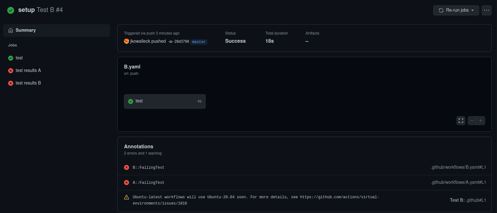

# test [action-junit-report]

something seams odd with the reporting:
reports are attached to the wrong action runs.

reported as Issue: https://github.com/mikepenz/action-junit-report/issues/34

## Setup

Having multiple github actions. Each action uses [action-junit-report] to report junit test results.  
Multiple github actions can run at the same time.

## Expected

Each github action has its junit reporting added to its own run.

## Observed

One github action has all the junit reporting added to its run.
All the other github actions don't have any reported to their runs.

  
  

[action-junit-report]: https://github.com/mikepenz/action-junit-report "action-junit-report"
